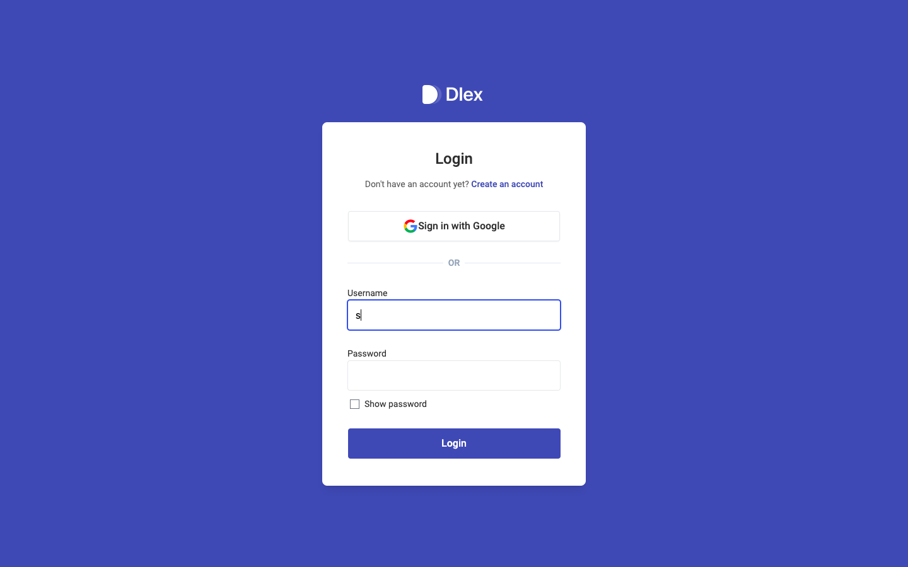

# Dlex-backend



## Introduction

Welcome to the Dlex project, an open-source initiative aimed at creating a versatile application for managing the affairs of small to medium-sized organizations. Dlex is designed to reduce fraud within an organization and create a secure and efficient system for managing various aspects, from products to transactions and more.

## Technologies Used

Dlex is built using a stack of modern technologies:

- **Electron:** For the multi-platform desktop application frontend.
- **Node.js:** For the backend server.
- **Express:** As the web application framework.
- **MongoDB:** As the database system.

## Key Features

### Offline and Auto-Syncing

One of Dlex's standout features is its ability to work seamlessly both online and offline. When connected to the internet, data is automatically synchronized with the central server. Users can continue working even when offline, and once they're back online, Dlex automatically syncs their changes, ensuring data integrity and accessibility at all times.

### Automated Reports in Excel Format

Dlex simplifies reporting by generating automated reports in Excel (.xls) format. These reports are sent directly to the user's email, making it easy to access and share critical information. Whether it's transaction summaries, product catalogs, or financial statements, Dlex streamlines the reporting process, saving time and effort for users.

## How to Contribute

Dlex is an open-source project, and we welcome contributions from developers with JavaScript skills. If you're interested in getting involved, here's how you can contribute:

1. **Fork the Repository:** Start by forking the Dlex repository on GitHub [here](https://github.com/Chris-Imade/dlex-backend).

2. **Clone the Repository:** Clone your forked repository to your local development environment using the following command:

*git clone https://github.com/Chris-Imade/dlex-backend.git*


3. **Set Up the Development Environment:** Follow the project's documentation to set up your development environment. Ensure you have all the required dependencies installed.

4. **Pick an Issue:** Visit the project's [issue tracker](https://github.com/Chris-Imade/dlex-backend/issues) to find tasks and issues you'd like to work on. You can filter by difficulty or type to find tasks that match your skills and interests.

5. **Create a Branch:** Create a new branch for your work based on the latest `main` branch. Use a descriptive name that relates to the issue you're addressing.

*git checkout -b feature/your-feature-name*

6. **Code and Test:** Write your code following the project's coding standards and guidelines. Ensure your changes are well-tested.

7. **Submit a Pull Request (PR):** Once you're satisfied with your changes, submit a pull request to the Dlex repository. Be sure to include a clear and concise description of your changes and reference the issue you're addressing.

8. **Code Review:** Your PR will undergo code review by project maintainers. Be prepared to make necessary changes based on feedback.

9. **Merge and Celebrate:** After your PR is approved, it will be merged into the main project. Congratulations, you've contributed to Dlex!

## Get Started

Ready to get started? Check out the Dlex repository [here](https://github.com/Chris-Imade/dlex-backend) and join us in building a safer and more efficient way for organizations to manage their affairs.

## Testing and Feedback

We encourage testers to try out the Dlex software and provide valuable feedback. If you encounter any issues, have suggestions for improvements, or want to share your experience, please:

- **Create an Issue:** Visit the project's [issue tracker](https://github.com/Chris-Imade/dlex-backend/issues) and create an issue describing the problem or suggestion you have. Your feedback is invaluable in making Dlex even better!

We appreciate your support in making Dlex a reliable and user-friendly solution.

- **Routes**

1. **Products Routes**

- It is worth noting that most endpoints requires the userId to be passed on as a query to the path, it's also worth noting that each request except the authentication requests are to have an Authoriazation header with the value of type {{Token actual_token}}

- Post: `{{ _.baseURL }}/api/v1/reports/sendTransaction?userId={{userId}}`: This endpoint fetches all the transactions belonging to the current user, converts the data to a CSV file, and then sends the file to the user's registered email.

- Post: `{{ _.baseURL }}/api/v1/products?userId={{userId}}`: This endpoint is responsible for creating a new product based on the JSON data provided in the request body. Once the product is successfully created, it not only stores the new product in the system but also provides a response that includes details about the newly created product. This allows users to access information about the product they've just added to the system, enhancing the user experience and providing confirmation of the successful creation of the product.

- Get: `{{ _.baseURL }}/api/v1/products?userId={{userId}}`: This endpoint serves as a query to retrieve all the products that have been created by the user. It operates without the need for any additional parameters or data parsing within the request body. When accessed, this endpoint provides a comprehensive list of all the products associated with the user, offering a convenient way to access and manage their product portfolio.

- Get: `{{ _.baseURL }}/api/v1/products/{{productId}}?userId={{userId}}`: This endpoint retrieves a specific product by using the product's unique identifier, which is passed as a parameter in the path.

- Put: `{{ _.baseURL }}/api/v1/products/{{productId}}?userId={{userId}}`: This endpoint is responsible for updating a product based on its unique identifier, which is provided as a parameter in the request path. It accepts the updates as a JSON object within the request body. After processing the update, it responds by returning the product with all modifications applied, ensuring that users have access to the most up-to-date product information.

- Delete: `{{ _.baseURL }}/api/v1/products/{{productId}}?userId={{userId}}`: This endpoint performs a series of actions when a product is deleted. First, it extracts the user's email from the user's token provided in the Authorization header. Next, it utilizes this email, along with the Nodemailer library and other relevant components, to send notifications to the user, admin, or owner, informing them that specific products have been successfully deleted. This comprehensive notification system ensures that all relevant parties are informed of the deletion event.

- Additionally, it's important to mention that the images associated with the products are stored as base64 strings. When a user initiates a delete request, these images undergo a process where they are uploaded to Cloudinary. Cloudinary then serves as the source for generating preview images, which are subsequently utilized as thumbnails within the email notifications. This approach enhances the efficiency and presentation of product deletion notifications.

2. **Transaction Routes**


- Post: `{{ _.baseURL }}/api/v1/transaction?userId={{userId}}`: This endpoint is responsible for the creation of new transactions based on the JSON data provided within the request body. Once the transaction is successfully created, it not only stores the new transaction in the system but also provides a response that includes details about the newly created transaction. This enables users to access information regarding the transaction they've just added to the system, enhancing user experience and confirming the successful creation of the transaction.

- Get: `{{ _.baseURL }}/api/v1/transaction?userId={{userId}}`: This endpoint serves as a query to retrieve all the transactions that have been created by the user. It operates without requiring any additional parameters or data parsing within the request body. When accessed, this endpoint provides a comprehensive list of all the transactions associated with the user, offering a convenient way to access and manage their transaction history.

- Get: `{{ _.baseURL }}/api/v1/transaction/{{transactionId}}?userId={{userId}}`: This endpoint retrieves a specific transaction by using the transaction's unique identifier, which is passed as a parameter in the request path.

- Put: `{{ _.baseURL }}/api/v1/transaction/{{transactionId}}?userId={{userId}}`: This endpoint is responsible for updating a transaction based on its unique identifier, which is provided as a parameter in the request path. It accepts the updates as a JSON object within the request body. After processing the update, it responds by returning the transaction with all modifications applied, ensuring that users have access to the most up-to-date transaction information.

- Delete: `{{ _.baseURL }}/api/v1/transaction/{{transactionId}}?userId={{userId}}`: This straightforward process involves filtering out the transaction based on the provided ID and subsequently deleting it from the system.


3. **For the users route:**
- Get: `{{ _.baseURL }}/api/v1/users/user-id:`: This route efficiently utilizes the Authorization header to extract the user's ID and promptly returns it as a response. This functionality proves invaluable when there is a need to obtain the user's ID for making subsequent requests, streamlining the process of gathering essential user information for various operations.

- Put: `{{ _.baseURL }}/api/v1/users/user/{{userId}}`: This endpoint anticipates that the new updates to the user's document will be included in the request body, while the user's document's unique ID requiring an update is passed as a parameter. Upon successful execution, this endpoint responds by providing the updated user object, ensuring that users have access to the most current user information after the update.

- Get: `{{ _.baseURL }}/api/v1/users/user/{{userId}}`: This endpoint retrieves a single user based on their unique user ID.

**For Authentication:**
**Post: `{{ _.baseURL }}/api/v1/auth/register`**
--- **This route takes some basic information about the user in this format:**
```javascript
{
	"email": string,
	"username": string,
	"password": string,
	"isAdmin": boolean
}
```

**it returns:**
```javascript
{
	"message": "Success",
	"status": 201,
	"detail": "User successfully created"
} 
```
--- **when successful and an error when not. Errors may vary depending on the kind of issues to be addressed.**

- **Post: `{{ _.baseURL }}/api/v1/auth/login`**
--- **This endpoint expects as minimal as:**
```javascript
{
	"username": string,
	"password": string
}
```

--- **and returns and example response:**
```javascript
{
	"message": "Success",
	"status": 200,
	"details": "User successfully logged in 😇",
	"token": "jwt token here"
}
```

--- **when everything works fine. And a corresponding error when things goes sideways.**